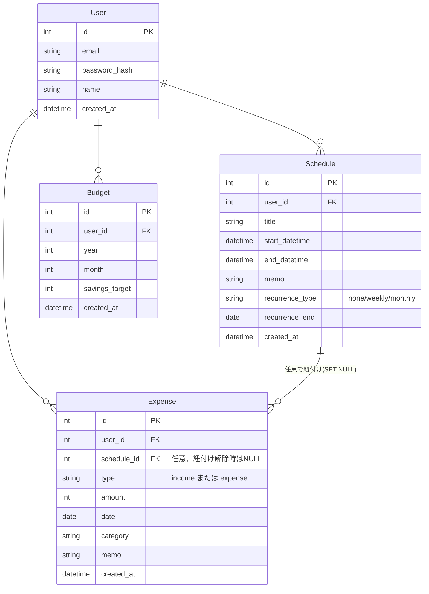

# PlannerwithExpense

家族向け予定・家計簿アプリ。

## 1. このアプリについて

家族の「予定」と「支出」を一つのアプリで一元管理したい、という目的で作成した。これまで別々に管理していた家族のスケジュールと支出を一箇所にまとめ、把握しやすくすることをねらいとしている。

- **対象ユーザー**：家族メンバー（それぞれ自分のアカウントを持つ）
- **主なユースケース**：家族の予定をカレンダーで確認・登録・編集・削除する／支出を記録・確認・編集・削除する／自分のアカウントでログイン・ログアウトする

詳細は[docs/01_purpose-usecase.md](docs/01_purpose-usecase.md)を参照。

## 2. デモ画面

ログイン画面


ログイン後の操作デモ

https://github.com/user-attachments/assets/d43f8059-c6fa-43f8-8c49-d0bda23732fb

CSVエクスポート結果（ダミーデータ）


## 3. 機能一覧

### ユーザー認証機能

| ID | 機能名 | 内容 |
|----|--------|------|
| F09 | アカウント登録 | メールアドレス＋パスワードで家族メンバーがアカウントを作成できる |
| F10 | ログイン／ログアウト | 登録したアカウントでログイン・ログアウトできる。認証トークンが無効になった場合（期限切れ等）は、API呼び出し時に自動でログイン画面へ遷移する |

### 予定管理機能

| ID | 機能名 | 内容 |
|----|--------|------|
| F01 | カレンダー表示 | 月単位で予定を一覧表示できる。前月/次月ナビゲーションで表示月を切り替えられる。月表示と週表示を切り替えられる |
| F02 | 予定登録 | 新しい予定を登録できる。カレンダーの日付セルをクリックすると、その日付が入力済みの状態で登録モーダルを開ける。繰り返し（毎週・毎月、終了日の指定可）を設定できる |
| F03 | 予定編集 | 登録済みの予定を編集できる。繰り返し予定の編集はシリーズ全体（ルールごと）に反映される |
| F04 | 予定削除 | 登録済みの予定を削除できる。日別詳細モーダルから直接削除できる。繰り返し予定の削除はシリーズ全体に反映される |
| F11 | 日別詳細表示 | カレンダーの日付セルは予定・家計簿の有無を「予定あり」「支出あり」「収入あり」の集約バッジで表示し、クリックするとその日の一覧・追加・編集・削除ができる詳細モーダルを開ける |
| F14 | 予定の月別一覧表示 | サイドバーから年→月と辿ることで、指定した月の予定を一覧（テーブル形式）で表示できる。繰り返し予定もその月に該当する日ごとに展開されて表示される |

### 家計簿機能

| ID | 機能名 | 内容 |
|----|--------|------|
| F05 | 収入・支出登録 | 区分（収入/支出）・金額・日付・カテゴリ・メモを入力して記録できる。カテゴリはプリセットからの選択、または「その他」を選んで自由入力できる。金額はキーボードでの直接入力に加え、電卓ボタンから四則演算しながら入力することもできる |
| F06 | 収入・支出一覧表示 | 記録した収入・支出を一覧で確認できる。区分をバッジ・色分けで区別できる。カレンダー画面からも直接支出を追加できる。日付の昇順/降順での並び替え、黒字（収入）のみ/赤字（支出）のみの抽出ができる |
| F07 | 収入・支出編集 | 登録済みの記録を編集できる（区分の変更も可能） |
| F08 | 収入・支出削除 | 登録済みの記録を削除できる |
| F15 | 収入・支出の年月フィルタ一覧 | サイドバーから年→月と辿ることで、指定した月の収入・支出だけに絞り込んだ一覧を表示できる。「全期間を見る」で絞り込みを解除できる。月表示に加えて、週単位で絞り込む表示にも切り替えられる |
| F17 | CSVエクスポート | 収入・支出の一覧をCSVファイルとしてダウンロードできる |
| F20 | 予定との紐付け | 収入・支出登録時に、同じ日の予定を任意で選択して紐付けできる（DB上はFKで関連付け。紐付けた予定が削除されると紐付けのみ解除される） |

### 予算管理機能

| ID | 機能名 | 内容 |
|----|--------|------|
| F12 | 月次貯蓄目標設定 | 月ごとに貯蓄目標額を設定できる（1ヶ月につき1件、後から変更可能）。金額入力は収入・支出登録と同様、キーボード直接入力・電卓ボタンのどちらでも可能 |
| F13 | 財務状況表示 | カレンダー上部に、表示中の月の実際の収入・支出・貯蓄額（収入－支出）と、貯蓄目標との差分（黒字は黒、赤字は赤で色分け）を表示する |
| F18 | 年別財務状況表示 | 年ごとに、月別の収入・支出・貯蓄実績・貯蓄目標・差分・累積差分（年内で積み上げ、年をまたぐとリセット）を一覧表示する。前年/次年ナビゲーションで年を切り替えられる |
| F19 | 全期間財務状況表示 | データが存在する最初の年から最新の年までの、実際の貯蓄額（収入－支出）の合計を年別ビュー上部に表示する |

### ナビゲーション機能

| ID | 機能名 | 内容 |
|----|--------|------|
| F16 | サイドバーナビゲーション | 折りたたみ式のサイドバーで、カレンダー・家計簿・累計（年別財務状況）・ログアウトへ遷移できる。カレンダー・家計簿はシェブロンをクリックすると年→月の階層ナビゲーションが展開され、指定した月の一覧（F14/F15）へ直接遷移できる |

### UI

- Google Fonts「M PLUS Rounded 1c」による丸ゴシック系フォントで統一

機能要件の詳細（次フェーズ以降のバックログ含む）は[docs/04_functional.md](docs/04_functional.md)を参照。

### 画面遷移図

```mermaid
flowchart TD
    A[アプリを開く] --> B{ログイン済み?}
    B -->|未ログイン| C[ログイン画面]
    B -->|ログイン済み| D[カレンダー画面]
    C -->|新規登録| E[新規登録画面]
    E -->|登録完了| C
    C -->|ログイン成功| D
    D <-->|サイドバー: ラベルクリック| F[家計簿画面]
    D -->|サイドバー: 年別財務状況リンク| G[年別財務状況ページ]
    D -->|サイドバー: カレンダー年→月| H[予定一覧ページ]
    F -->|サイドバー: 家計簿年→月| I[家計簿(年月絞り込み)]
    I -->|全期間を見る| F
    D -->|ログアウト| C
    F -->|ログアウト| C
```

### ER図



より詳細な画面構成・遷移図・ER図は[docs/03_structure.md](docs/03_structure.md)を参照。

## 4. 技術スタック

| 種類 | 技術 |
|------|------|
| フロントエンド | Vue3 + Vite + Pinia + vue-router |
| バックエンド | FastAPI + SQLAlchemy + JWT認証 |
| データベース | MySQL 8.0 |
| インフラ | Docker Compose（ローカル）／ AWS EC2 + RDS（Terraform、本番相当デプロイ） |

## 5. インフラ構成・ディレクトリ構成

### アーキテクチャ

3層構成。フロントエンドはMySQLに直接アクセスせず、必ずバックエンドAPI経由でデータを操作する。

```
ブラウザ (Vue3 + Vite, :5173)
   │  fetch/axios → /api/*
   ▼
バックエンドAPI (FastAPI, :8000)
   │  SQLAlchemy
   ▼
MySQL (:3306)
```

### ディレクトリ構成

```
PlannerwithExpense/
├── frontend/         # Vue3 + Vite フロントエンド
│   └── src/
│       ├── api/          # バックエンドAPI呼び出し
│       ├── components/   # 再利用可能なUIコンポーネント（モーダル等）
│       ├── views/        # 画面単位のコンポーネント
│       ├── stores/       # Piniaストア
│       ├── router/       # vue-router設定
│       └── utils/        # 純粋関数（日付計算・繰り返し予定展開等）
├── backend/          # FastAPI バックエンド
│   ├── app/
│   │   ├── routers/      # APIエンドポイント
│   │   ├── models/       # SQLAlchemyモデル
│   │   ├── schemas/      # Pydanticスキーマ（バリデーション）
│   │   └── auth/         # 認証関連
│   ├── alembic/          # DBマイグレーション
│   └── tests/            # pytest
├── infra/
│   ├── terraform/    # AWS(EC2+RDS)構築用IaC
│   └── nginx/         # EC2上のリバースプロキシ設定
├── docs/              # 要件定義書・設計ドキュメント
└── prototype/         # 開発初期の静的HTMLモック（現行アプリでは未使用）
```

### 起動方法（ローカル）

```
cp .env.example .env
docker compose up --build
```

- フロントエンド: http://localhost:5173
- バックエンドAPI(Swagger UI): http://localhost:8000/docs

### 環境変数

| 変数名 | 説明 | 既定値 |
|--------|------|--------|
| JWT_SECRET | JWT署名用シークレット | devsecret-change-me(本番では必ず変更) |
| ENVIRONMENT | 実行環境(development/production) | development |
| CORS_ORIGINS | 許可するオリジン(カンマ区切りで複数指定可) | http://localhost:5173 |

`ENVIRONMENT=production`かつ`JWT_SECRET`が既定値のままの場合、起動時にエラーとなりアプリが立ち上がらない(既知の値でのトークン偽造を防ぐため)。他人がアクセスできる環境にデプロイする際は、`JWT_SECRET`を強力な値に変更した上で`ENVIRONMENT=production`を設定すること。

### DBマイグレーション

スキーマ変更はAlembicで管理する(`backend/alembic/`)。バックエンド起動時に自動で`alembic upgrade head`が実行されるため、`docker compose up`するだけで最新スキーマが適用される。

モデル(`backend/app/models/`)を変更した場合は、以下の手順でマイグレーションファイルを作成しコミットする。

```
docker compose exec backend alembic revision --autogenerate -m "変更内容の説明"
```

生成されたファイルは`backend/alembic/versions/`配下に作成される。適用はバックエンド再起動時に自動で行われる(手動で適用したい場合は`docker compose exec backend alembic upgrade head`)。

> **移行時の注意**: Alembic導入前に`create_all()`で作成された(Alembic管理外の)DBが残っている環境では、次回`docker compose up`前に一度だけ`docker compose down -v`でボリュームを削除してから起動すること。以降はマイグレーションで管理されるため`down -v`は不要になる。

### AWSデプロイ

Terraformで構築したEC2(t3.micro) + RDS MySQL(db.t3.micro)に本番相当のデプロイができる（無料枠の範囲。学習用個人アプリのため常時稼働はさせず、必要時のみ`terraform apply`/`terraform destroy`する運用を想定）。

- Terraformリソース: `infra/terraform/`
- 構成・デプロイ手順の詳細: [docs/08_deployment.md](docs/08_deployment.md)
- E2E動作確認の記録: [docs/deployment-verification.md](docs/deployment-verification.md)

## 6. 品質チェック

### テスト

バックエンド(pytest)・フロントエンド(vitest)ともに自動テストを導入している。

- バックエンド: ユーザー登録・ログイン、所有者スコープ(他ユーザーのデータが見えないこと)のテスト。テスト用のDB接続はSQLite等の代替ではなく、アプリの通常のDB設定(実質MySQL)を使用し、テストごとにトランザクションをロールバックすることで実DBを汚さない
- フロントエンド: `scheduleOccursOnDate`(`frontend/src/utils/recurrence.js`)などの純粋関数の単体テスト

```
docker compose exec backend pytest
docker compose exec frontend npm test
```

検証内容・結果は[docs/test.md](docs/test.md)を参照。

### Lint

フロントエンドはESLint(`eslint-plugin-vue`)を導入している。既存コードのスタイル(1タグに複数属性を書く等)を変えないため、フォーマット系ルールを含む`flat/recommended`ではなく、Vueの正確性チェックに絞った`flat/essential`を採用している。

```
docker compose exec frontend npm run lint
```

バックエンドは`ruff`を導入している。デフォルトの`E4`/`E7`/`E9`/`F`(pyflakes+明確なバグにつながるpycodestyleエラー)のみを対象にし、import順序等の書式ルールは追加していない(`backend/pyproject.toml`)。

```
docker compose exec backend ruff check .
```

`requirements.txt`を変更した場合は`docker compose up --build backend`でイメージを再ビルドする必要がある。

### 入力バリデーション

金額・自由入力テキストに対するバリデーションをバックエンド・フロントエンド両方に実装している。

- 金額系フィールド(支出・収入の金額、貯蓄目標): マイナス・ゼロを禁止し、上限値を設定
- 自由入力フィールド(カテゴリ・タイトル・メモ): 文字数制限(DBカラムサイズと整合)、前後の空白除去、空文字を禁止
- 予定の開始日時・終了日時・繰り返し終了日の前後関係チェック
- バックエンドのバリデーションエラー(422)は、既存の`HTTPException`と同じ形式(`detail`が文字列)で返るよう統一し、フロントエンドの各モーダルで保存失敗時にエラーメッセージを表示する

検証内容・結果は[docs/input-validation-test.md](docs/input-validation-test.md)を参照。

### セキュリティ

- ログイン・登録API(`/api/auth/login`・`/api/auth/register`)には`slowapi`によるIPベースのレート制限を設定している(login: 5回/分、register: 3回/分)。上限を超えると429を返す
- 登録パスワードは英字・数字を両方含む8文字以上を必須とする(`backend/app/schemas/auth.py`)
- JWT_SECRETについては上記「環境変数」を参照

### 品質チェックの実施記録

フロントエンド・バックエンド・DBそれぞれ独立したセッションで`/quality-check`コマンドによる品質チェックを実施した。進め方・結果は[docs/quality-check.md](docs/quality-check.md)を参照。

## 7. ドキュメント一覧

| ドキュメント | 内容 |
|---|---|
| [docs/01_purpose-usecase.md](docs/01_purpose-usecase.md) | 使用目的・対象ユーザー・ユースケース |
| [docs/02_non-functional.md](docs/02_non-functional.md) | 非機能要件（セキュリティ・デザイン・アクセシビリティ等） |
| [docs/03_structure.md](docs/03_structure.md) | 画面構成・画面遷移図・ER図 |
| [docs/04_functional.md](docs/04_functional.md) | 機能要件一覧（機能ID付き） |
| [docs/05_environment.md](docs/05_environment.md) | 技術スタック・開発期間 |
| [docs/06_prototype-design.md](docs/06_prototype-design.md) | プロトタイプ設計書（開発初期の静的モック） |
| [docs/07_troubleshooting.md](docs/07_troubleshooting.md) | 開発中に発生した問題と対処法 |
| [docs/08_deployment.md](docs/08_deployment.md) | AWSデプロイ（Terraform: EC2+RDS）の構成・手順 |
| [docs/quality-check.md](docs/quality-check.md) | 品質チェックの進め方・結果・対応状況 |
| [docs/test.md](docs/test.md) | 自動テスト(pytest/vitest)導入の検証記録 |
| [docs/input-validation-test.md](docs/input-validation-test.md) | 入力バリデーション強化の検証記録 |
| [docs/db-migration-test.md](docs/db-migration-test.md) | Alembic(DBマイグレーション)導入の検証記録 |
| [docs/deployment-verification.md](docs/deployment-verification.md) | AWSデプロイ後のE2E動作確認記録 |
| [docs/requirements-template.md](docs/requirements-template.md) | 要件定義書のテンプレート（次プロジェクト用のひな形） |

## 8. 今後の課題

- **CSVエクスポートの収入/支出の見やすさ改善**：現状、CSV上は`type`列が`income`/`expense`の文字列表記のみで、画面上の色分け・+/-表示のような分かりやすさがない。表記の改善（例: 列を分ける、符号を付ける等）を検討する
- **予定と支出の紐付け機能(`schedule_id`)の必要性再検討**：実際の運用上、紐付けされていても機能として必要性を感じておらず、本当に必要な機能か改めて選定が必要。廃止する場合は[docs/03_structure.md](docs/03_structure.md)のER図（紐付け追加当時から更新されておらず記載が古い）もあわせて見直す

開発中に発生した問題と対処法は[docs/07_troubleshooting.md](docs/07_troubleshooting.md)を参照。
