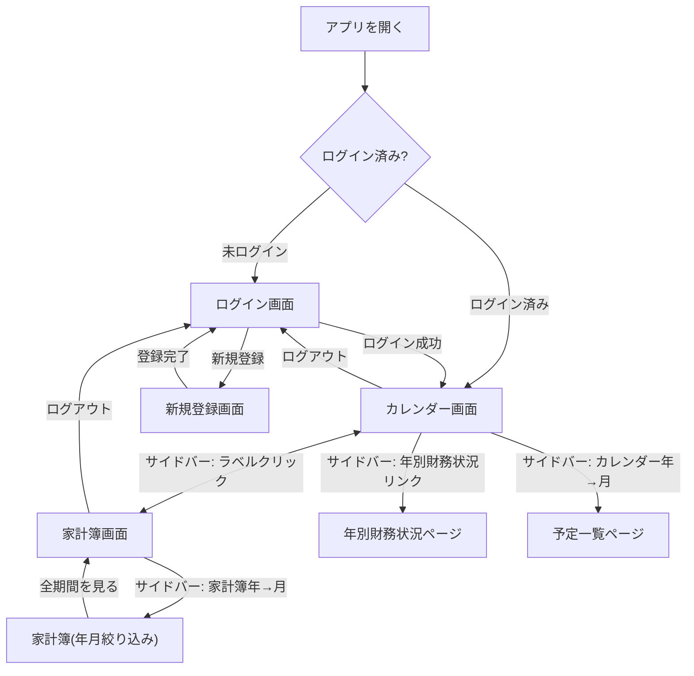
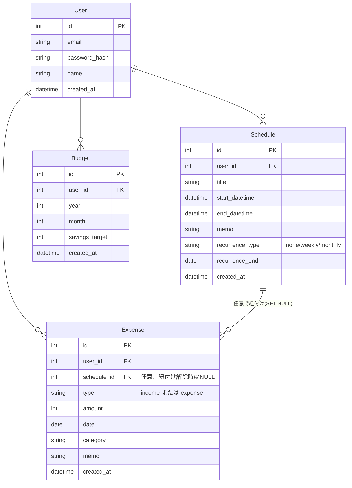

# 要件定義書　家族向け予定・家計簿アプリ（PlannerwithExpense）

# ④ 構成

---

## ④ 構成

### 画面構成

| 画面 | 主な内容 |
|------|---------|
| ログイン画面 | メール＋パスワードでログイン |
| 新規登録画面 | メール＋パスワードでアカウントを作成 |
| カレンダー画面 | 月表示/週表示を切り替えて予定を一覧表示（前月/次月・前週/次週ナビゲーション対応）。日付セルは予定・支出の有無を「予定あり」「支出あり」「収入あり」の集約バッジで表示し、クリックすると日別詳細モーダル（その日の予定・家計簿の一覧・追加・編集・削除）を開く。項目のない日をクリックした場合は予定追加モーダルを直接開く。ツールバーから直接支出も追加できる。カレンダー上部に当月の財務状況（収入・支出・貯蓄実績・貯蓄目標・差分）を表示し、年別財務状況ページへのリンクがある |
| 家計簿画面 | 収入・支出の一覧表示、収入・支出の追加・編集・削除（モーダル）。区分（収入/支出）をバッジと色分けで表示。CSVエクスポートが可能。年月を指定してその月だけに絞り込んだ一覧を表示することもできる（絞り込み時は「全期間を見る」で解除） |
| 予定一覧ページ | サイドバーの階層ナビゲーションから遷移。指定した年月の予定をテーブル形式で一覧表示し、追加・編集・削除ができる。繰り返し予定はその月に該当する日ごとに展開される |
| 年別財務状況ページ | 指定した年の月別の収入・支出・貯蓄実績・貯蓄目標・差分・累積差分（年内で積み上げ）を一覧表示。前年/次年ナビゲーション。ページ上部にデータが存在する全期間の累計財務状況も表示 |

サイドバーは折りたたみ式（デフォルト非表示、トグルボタンで開閉）。カレンダー・家計簿のラベルはそれぞれの一覧画面へ直接遷移し、横のシェブロンから年→月の階層ナビゲーションを展開して予定一覧ページ・家計簿の年月絞り込み一覧へ遷移できる。

### モジュール

| モジュール | 備考 |
|-----------|------|
| ユーザー認証 | メール＋パスワードによるアカウント登録・ログイン |
| 予定管理 | カレンダー表示（月/週切り替え、月送り・週送りナビゲーション）、繰り返し予定を含む予定のCRUD、月別一覧表示 |
| 家計簿 | 収入・支出記録のCRUD（区分あり、カテゴリはプリセット/自由入力）、CSVエクスポート、年月フィルタ一覧 |
| 予算管理 | 月ごとの貯蓄目標の設定、実際の収入・支出・貯蓄額との比較（当月・年別・全期間） |
| ナビゲーション | 折りたたみ式サイドバー、カレンダー・家計簿の年→月階層ナビゲーション |

### 画面遷移図

### ER図

※ `Budget`は`user_id`＋`year`＋`month`の組み合わせでユニーク（1ユーザー1ヶ月につき1件）。`savings_target`は「貯蓄目標額」で、実際の貯蓄額（収入－支出）はExpenseから都度計算する。`Expense.schedule_id`は支出登録時に同じ日の予定を任意で紐付けるためのFK（`ondelete SET NULL`、紐付けた予定が削除されると紐付けのみ解除される）。ただしカレンダー画面での集約表示（予定あり/支出あり/収入あり）自体は、この紐付けを使わず両テーブルをそれぞれ日付で突き合わせているだけ。`Schedule.recurrence_type`が`none`以外の場合、`start_datetime`を起点にクライアント側で該当日を展開する（DBに個別のインスタンス行は作らない）ため、`GET /api/schedules`は年月での絞り込みを行わず常に全件を返す。
