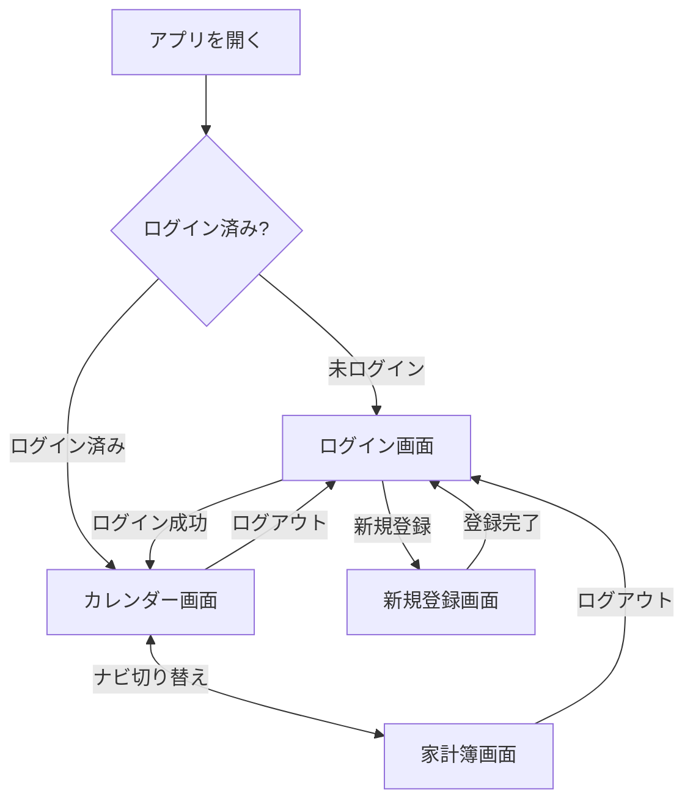
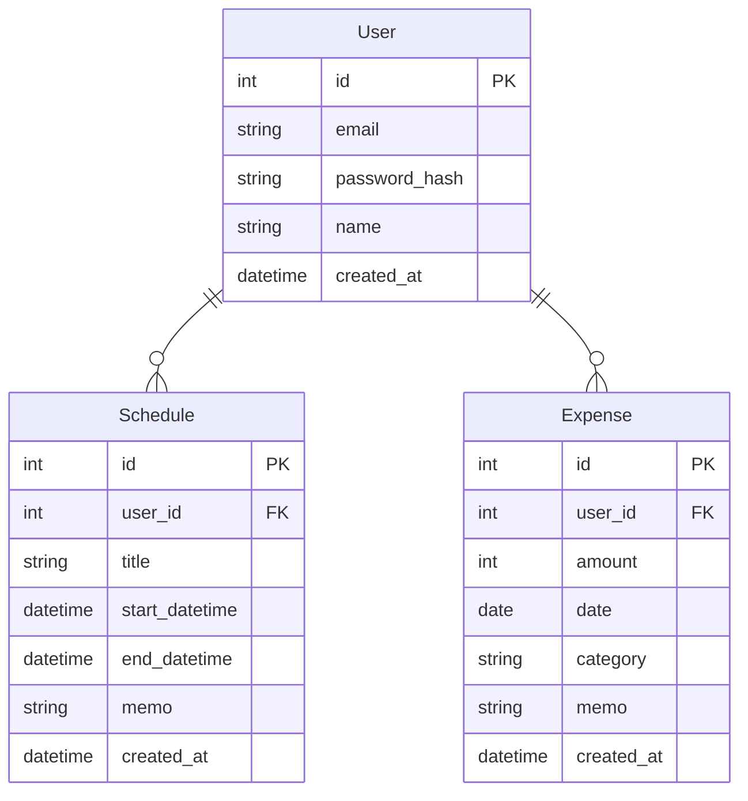

# 要件定義書　家族向け予定・家計簿アプリ（PlannerwithExpense）

# ④ 構成

---

## ④ 構成

### 画面構成

| 画面 | 主な内容 |
|------|---------|
| ログイン画面 | メール＋パスワードでログイン |
| 新規登録画面 | メール＋パスワードでアカウントを作成 |
| カレンダー画面 | 月・週単位で予定を一覧表示、予定の追加・編集・削除（モーダル） |
| 家計簿画面 | 支出の一覧表示、支出の追加・編集・削除（モーダル） |

### モジュール

| モジュール | 備考 |
|-----------|------|
| ユーザー認証 | メール＋パスワードによるアカウント登録・ログイン |
| 予定管理 | カレンダー表示、予定のCRUD |
| 家計簿 | 支出記録のCRUD |

### 画面遷移図

### ER図

