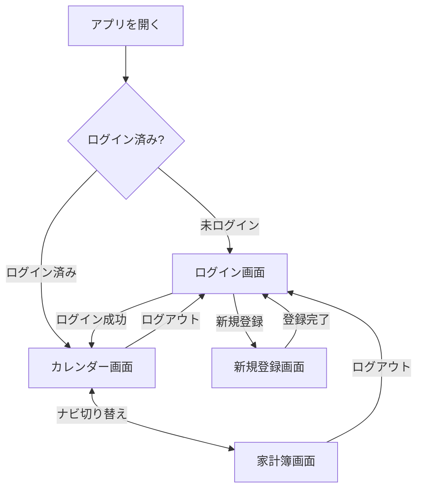
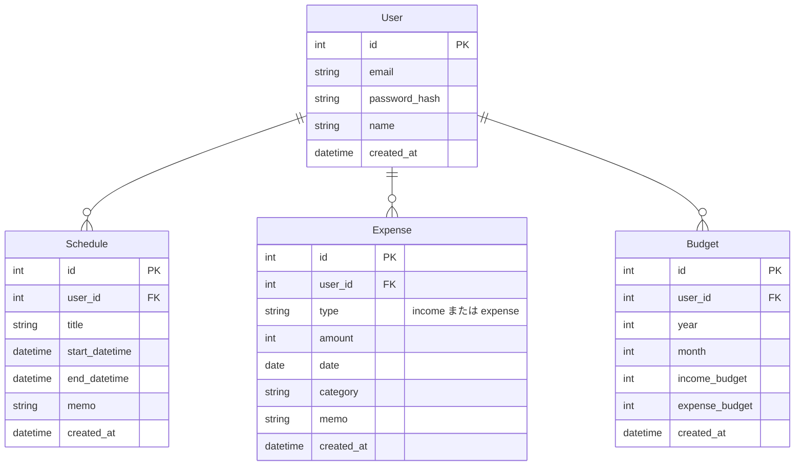

# 要件定義書　家族向け予定・家計簿アプリ（PlannerwithExpense）

# ④ 構成

---

## ④ 構成

### 画面構成

| 画面 | 主な内容 |
|------|---------|
| ログイン画面 | メール＋パスワードでログイン |
| 新規登録画面 | メール＋パスワードでアカウントを作成 |
| カレンダー画面 | 月単位で予定を一覧表示（前月/次月ナビゲーション対応）。日付セルは予定・支出の有無を「予定あり」「支出あり」「収入あり」の集約バッジで表示し、クリックすると日別詳細モーダル（その日の予定・家計簿の一覧・追加・編集・削除）を開く。項目のない日をクリックした場合は予定追加モーダルを直接開く。カレンダー上部に月次予算（収入・支出の目標と実績）を表示 |
| 家計簿画面 | 収入・支出の一覧表示、収入・支出の追加・編集・削除（モーダル）。区分（収入/支出）をバッジと色分けで表示 |

### モジュール

| モジュール | 備考 |
|-----------|------|
| ユーザー認証 | メール＋パスワードによるアカウント登録・ログイン |
| 予定管理 | カレンダー表示（月送りナビゲーション）、予定のCRUD |
| 家計簿 | 収入・支出記録のCRUD（区分あり） |
| 予算管理 | 月ごとの収入・支出目標の設定と実績比較 |

### 画面遷移図

### ER図

※ `Budget`は`user_id`＋`year`＋`month`の組み合わせでユニーク（1ユーザー1ヶ月につき1件）。`Schedule`と`Expense`の間に直接のリレーション（FK紐付け）はない。カレンダー画面での集約表示（予定あり/支出あり/収入あり）は、両テーブルをそれぞれ日付で絞り込んで突き合わせているだけで、データ上の紐付けは行っていない。
